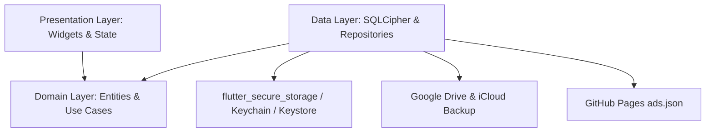

# Architecture & System Design — Safe Bloom (Flutter Feature-First)

## 1. High-Level System Architecture (Clean Architecture)



---

## 2. Brand Identity & Design System Specification

### Color Palette (Extracted from `SafeBloomlogo.png`)
- **Primary Brand / Deep Plum:** `#4A2040` (Text titles, prominent branding)
- **Secondary Petal Rose:** `#E88299` (Primary action buttons, active tab highlights)
- **Soft Blush Pink:** `#FCD5CE` (Phase highlights, cards, soft pills)
- **Drop Coral / Active Phase:** `#F05D78` (Period flow highlight, droplet accents)
- **Pure White Background:** `#FFFBFC` (Light theme main background)
- **Dark Elegance Background:** `#1A1118` (Dark theme main background)

### Typography Tokens
- **Brand Title / Display Headings:** `Cormorant Garamond` (Elegant Serif for "Safe Bloom" and main screen titles)
- **Tagline & Subheadings:** `Montserrat` (Medium weight, letter-spacing: `+1.5` to `+2.0` / +150 to +200 tracking, all-caps for taglines like `"YOUR CYCLE. YOUR PRIVACY. YOUR POWER."` & `"NO DATA. JUST CARE."`)
- **Body & UI Elements:** `Montserrat` (Regular & SemiBold for readability)

---

## 3. Directory Layout (Feature-First Architecture)

```
lib/
├── core/                       # Shared Design System, Theme Tokens & Utilities
│   ├── theme/
│   │   ├── app_colors.dart     # Color palette extracted from SafeBloomlogo.png
│   │   ├── app_typography.dart # Cormorant Garamond & Montserrat tokens
│   │   ├── app_spacing.dart    # Layout spacing & border radius tokens
│   │   └── app_theme.dart      # Flutter ThemeData (Light & Dark)
│   ├── utils/
│   │   └── date_formatter.dart
│   └── widgets/                # Reusable UI tokens
│
├── features/
│   ├── tracking/
│   ├── insights/
│   ├── onboarding/
│   └── settings/
│
└── main.dart
```

---

## 4. Mandatory UI/UX Rules
- **No Hardcoded UI:** Every screen and widget MUST pull colors, typography (`Cormorant Garamond` / `Montserrat`), margins, and borders from `core/theme/`.
- **Dumb Presentation Layer:** Widgets render state only; business logic resides strictly in domain use cases and state controllers.
